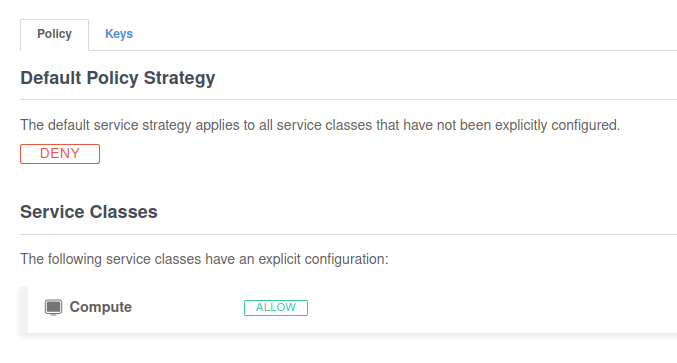

# Veilid Terraform Exoscale

## Cost

The setup is a bit weird, since you have to choose either pre-paid or post-paid, and pre-paid just means that you put in credit card information, and then you get billed automatically BUT Exoscale takes an initial charge of 20 CHF (a bit under $22). So presumably if you don't want that initial charge, you can select post-paid, but if you forget to manually send the payment, they might turn off the instance. It's up to you which option you prefer.

The configuration in this repo (micro instance for compute with 10GB of local storage) will cost about $7/month. They don't charge for IPv4 addresses on instances, so we'll run this in dual-stack (IPv4/IPv6 connectivity).

## Setting up access

1. Sign up for an [Exoscale account](https://www.exoscale.com/) if you don't already have one. You'll be asked to set up an organization when you first log in. It doesn't matter what value you put, since it's not referenced anywhere in the terraform.

2. Get your API keys by creating an IAM role with all permissions on the compute scope. Then create an API key, copy `.env.example` to `.env` and use the values shown in the UI to fill out the two variables there.



3. Run `source .env` and you're ready to run `terraform init` to set up the configuration.

## Running the terraform commands

1. Add the contents of your public SSH key to the `exoscale_ssh_key` resource in `main.tf`. Also, make sure you do the same in `setup-veilid.yaml`. If you don't do both of these, you'll get an annoying prompt for the `veilid` user's password when you try to log in.

> If you want to use a separate SSH key, then generate one in this folder like `ssh-keygen -t ed25519 -o -a 100 -f veilid-key`.

2. Decide which zone you want to run a veilid node in (the default is set to run in Zurich). If you don't mind, then just leave it as is. If you want to run more than 1 node, change the value for `number_of_instances` in `main.tf`.

3. Run the terraform command and get a/some shiny new node(s)!

```sh
terraform apply
```

You'll see the public IP addresses to use to connect via SSH.

```sh
Outputs:

public_ip_ipv4 = [
    "159.100.248.146",
]
public_ip_ipv6 = [
    "2a04:c44:e00:d538:49d:10ff:fe00:9a",
]
```

and you can connect via ssh like so:

```sh
ssh -i ROUTE_TO_PRIVATE_KEY veilid@IP_ADDRESS_FROM_OUTPUT
```

> NOTE: since the cloud init script takes a bit of time to run, if you SSH in immediately, you might not have access to the `veilid-cli` command for a minute or so.
